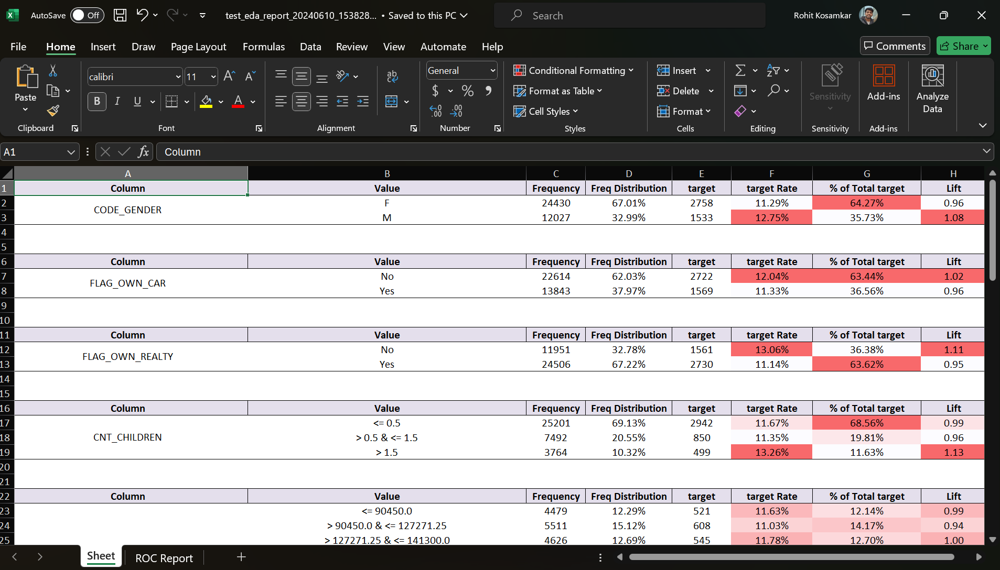
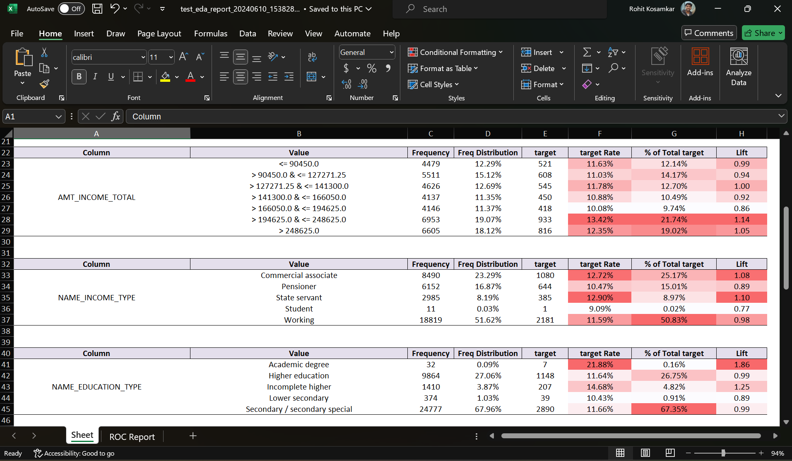
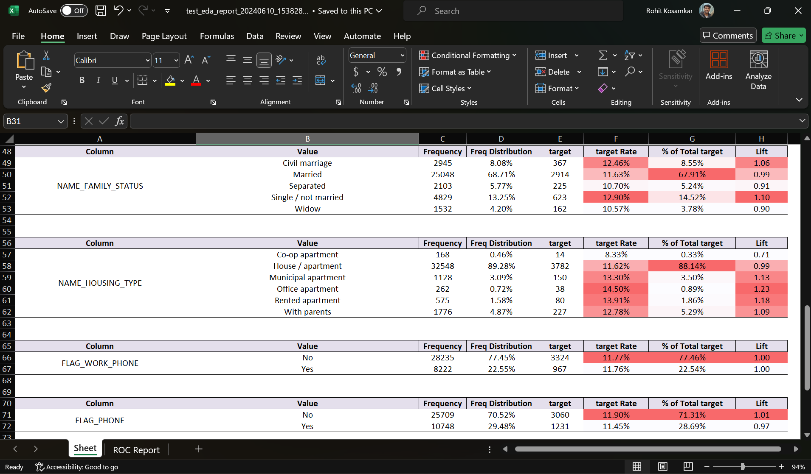
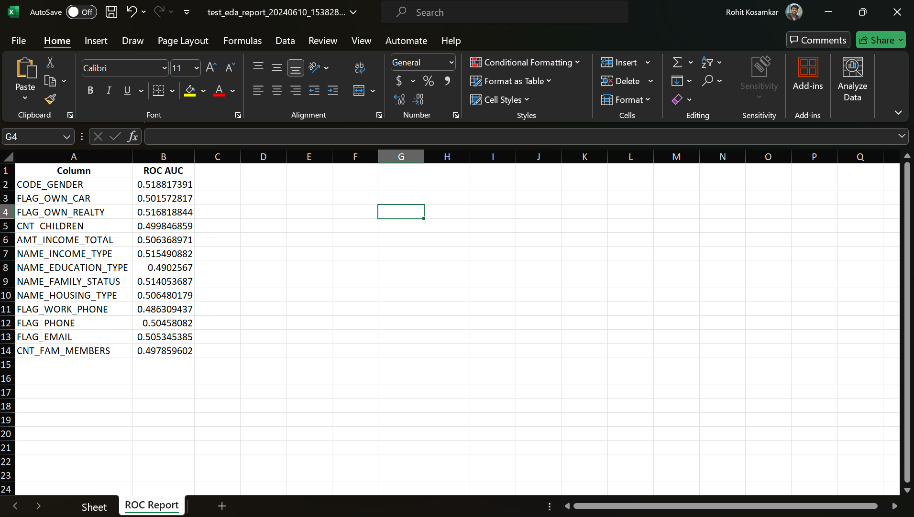

# EDAExcelReport

EDAExcelReport is a Python package for generating detailed exploratory data analysis (EDA) reports specifically for datasets with binary target variables. The package creates comprehensive EDA reports in Excel format, which include statistics and visualizations in the form of table that help in understanding the distribution and relationship of various features with the target variable.

## Features

- Calculates frequency and distribution of feature values.
- Computes target rate, percentage of total target, and lift for each feature value.
- Automatically handles numeric and categorical data.
- Generates Excel reports with well-formatted tables and conditional formatting.
- Removes gridlines and adds borders for better readability.

## Installation

You can install the package via pip:

```sh
pip install EDAExcelReport
```

```python

# How to import?
from EDAR.excel_report import EDAExcelReport

```


```python
# Import necessary libraries
import pandas as pd
import numpy as np
import os
from EDAR.excel_report import EDAExcelReport

```

```python
# Loading the credit dataset
df = pd.read_csv(r"tests\credit_data.csv")
```

```python
df.columns
```
    Index(['ID', 'CODE_GENDER', 'FLAG_OWN_CAR', 'FLAG_OWN_REALTY', 'CNT_CHILDREN',
           'AMT_INCOME_TOTAL', 'NAME_INCOME_TYPE', 'NAME_EDUCATION_TYPE',
           'NAME_FAMILY_STATUS', 'NAME_HOUSING_TYPE', 'DAYS_BIRTH',
           'DAYS_EMPLOYED', 'FLAG_MOBIL', 'FLAG_WORK_PHONE', 'FLAG_PHONE',
           'FLAG_EMAIL', 'OCCUPATION_TYPE', 'CNT_FAM_MEMBERS', 'target'],
          dtype='object')


```python
df.isna().sum()
```
    ID                         0
    CODE_GENDER                0
    FLAG_OWN_CAR               0
    FLAG_OWN_REALTY            0
    CNT_CHILDREN               0
    AMT_INCOME_TOTAL           0
    NAME_INCOME_TYPE           0
    NAME_EDUCATION_TYPE        0
    NAME_FAMILY_STATUS         0
    NAME_HOUSING_TYPE          0
    DAYS_BIRTH                 0
    DAYS_EMPLOYED              0
    FLAG_MOBIL                 0
    FLAG_WORK_PHONE            0
    FLAG_PHONE                 0
    FLAG_EMAIL                 0
    OCCUPATION_TYPE        11323
    CNT_FAM_MEMBERS            0
    target                     0
    dtype: int64


```python
ignore_feats = ["ID", "OCCUPATION_TYPE", "DAYS_BIRTH", "DAYS_EMPLOYED", "FLAG_MOBIL"]
```

```python
EDAExcelReport(df, 'target',r'tests\test_eda_report.xlsx', ignore_cols= ignore_feats)
```

    Your EDA report is ready at tests\test_eda_report_20240610_153828.xlsx
    
    <ed_report.excel_report.EDAExcelReport at 0x188c09ee9f0>

### Exploratory Data Analysis Excel File for above Credit Data you can download from here: 

[Download Excel File](https://github.com/rohit180497/EDAExcelReport/blob/main/tests/test_eda_report_20240610_153828.xlsx)

## Screenshots

### Screenshot 1


### Screenshot 2


### Screenshot 3


### Screenshot 4


## License

This project is licensed under the MIT License.

